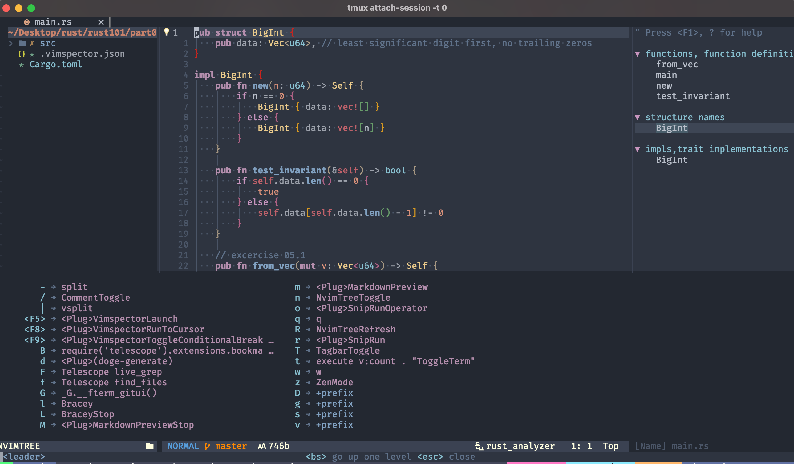
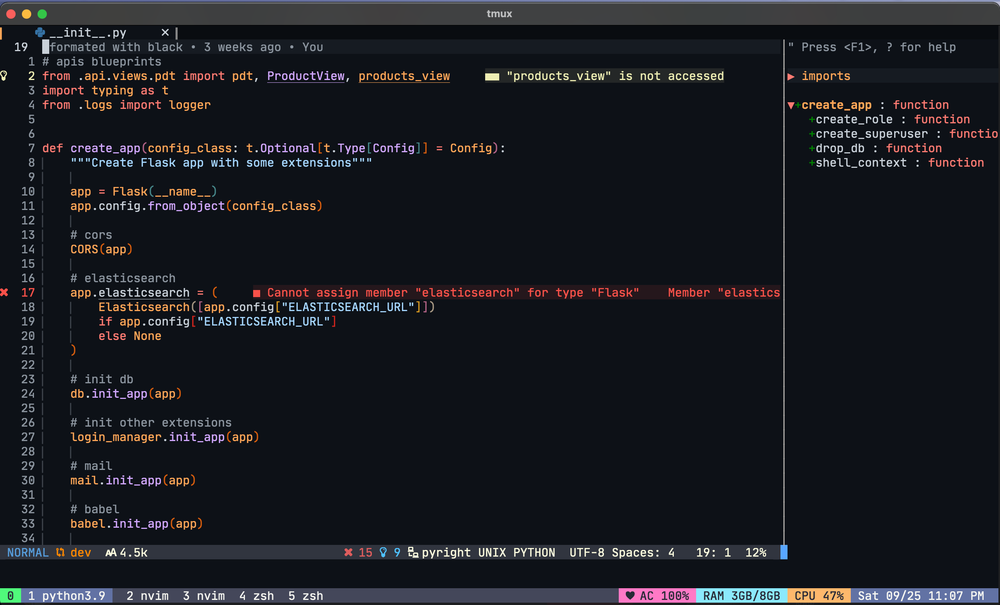
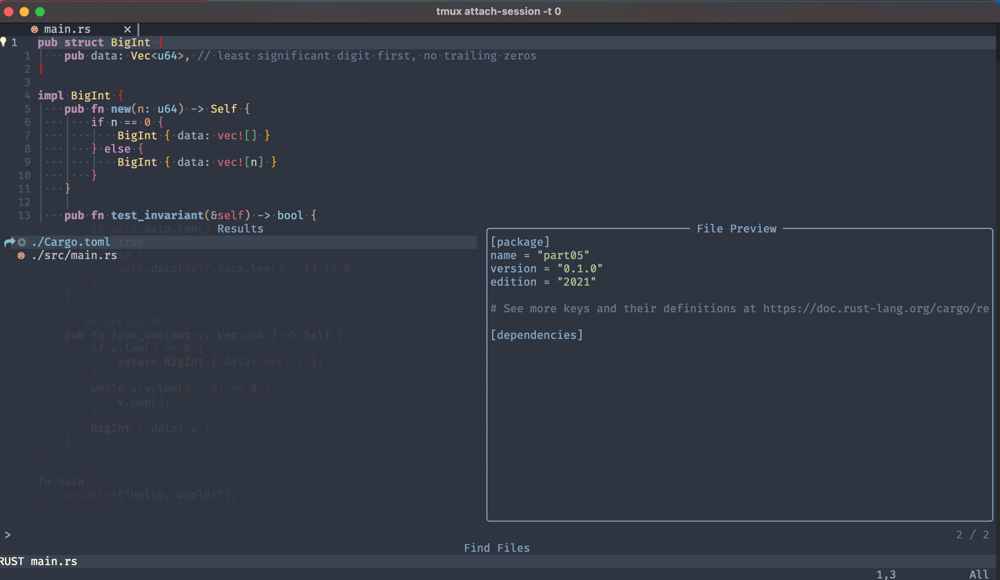
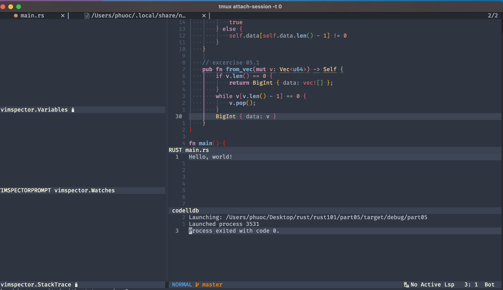

# My configurations for Neovim editor

Currently, I use `Neovim` on `macOS`, so this guide will work well on `macOS` only. I'll update for another platforms later...
This configuration supports (includes syntax highlighting and autocompletion) for these languages:

- `Python`
- `Javascript`
- `Typescript`
- `Rust`
- `C`
- `C++`
- `Go`
- `Html`
- `Css`
- `Lua`
- `Cmake`
- `Json`
- `Docker`
- `Yaml`

## Prerequisites:

You need to install these tools first:

- [pyenv](https://github.com/pyenv/pyenv)
- [neovim](https://github.com/neovim/neovim)
- `python3.+`
- `nodejs` and `npm`
- [luajit](https://luajit.org/luajit.html)
- [gitui](https://github.com/extrawurst/gitui)
- [lua-language-server](<https://github.com/sumneko/lua-language-server/wiki/Build-and-Run-(Standalone)>)
- [rust-analyzer](https://rust-analyzer.github.io/manual.html#rust-analyzer-language-server-binary)
- [gopls](https://github.com/golang/tools/blob/master/gopls/doc/vim.md)
- [clangd](https://clangd.llvm.org/installation.html)
- [stylua](https://github.com/JohnnyMorganz/StyLua)

### Neovim

In order to have all the newest features, you should install the [Nightly version](https://github.com/neovim/neovim/wiki/Installing-Neovim).

And also need to install `luajit` by command: `brew install --HEAD luajit`

### Python providers

I've used `python3` as a default version on my mac. If you use another versions of `Python`.
Please edit the `g:python3_host_prog` variable to your probably path of `Python` in `user-config.lua` file.
If your machine doesn't have any versions of `Python`, you could install [follow this](https://www.python.org/).
After install `Python`, you must install `pynvim`

```
pip3 install pynvim
```

### Nodejs and npm

There're a lot of plugins that use external packages (like language server protocol,...) of Neovim. And we need to install [Nodejs and npm via download](https://nodejs.org/en/download/)
[or via package manager](https://nodejs.org/en/download/package-manager/).

`neovim` Nodejs client is also needed:

```
npm install -g neovim
```

## How to use it?

### 1. Install.

Run this command if you use fish shell:

```
bash (curl -s https://raw.githubusercontent.com/tranvietphuoc/nvim/master/install.sh | psub)
```

or if you use another shell:

```
bash <(curl -s https://raw.githubusercontent.com/tranvietphuoc/nvim/master/install.sh)
```

and then type to the terminal command:

```
nvim
```

to open the editor first, then run command:

```
:PackerInstall

```

then install the LSP with [LspInstall](https://github.com/kabouzeid/nvim-lspinstall)


**For debuggers install**

I use [nvim-dap](https://github.com/mfussenegger/nvim-dap) as a debugger adapter. Currently, this configuration just can debug with `Python` and `C/C++/Rust`
You need to install `debugpy` and `vscode-lldb` using [DAPinstall](https://github.com/Pocco81/DAPInstall.nvim).

**Notice here:** You need to edit your path to debugger adapter of `vscode-lldb` in the `./lua/debugger/init.lua` file.


You can config your settings in `config/init.lua` file


### 2. Some basic keys mapping of this configuration.

---

|     Keys        |                   Command               | Mode         | Comment                                  |
| :-------------: | :--------------------------------------:|:------------:|:----------------------------------------:|
|     `,`         | `Leader`                                | `n` or`v`    | *Leader key*                             |
| `<leader>/`     | `:CommentToggle<CR>`                    | **all mode** | *Comment out codes*                      |
| `<leader>T`     | `:TagbarToggle<CR>`                     | `n`          | *Trigger tagbar*                         |
| `<leader>n`     | `:NvimTreeToggle<CR>`                   | `n`          | *Trigger nvim-tree*                      |
| `<Tab>`         | `:BufferNext<CR>`                       | `n`          | *Move to next tab*                       |
| `<S-Tab>`       | `:BufferPrevious<CR>`                   | `n`          | *Move to previous tab*                   |
|  `<S-c>`        | `:BufferClose<CR>`                      | `n`          | *Close tab*                              |
|     `qq`        | `<Esc>`                                 | **all mode** | *Esc*                                    |
| `<leader>f`     | `<cmd>Telescope find_files<CR>`         | `n`          | *find files*                             |
| `<leader>F`     | `<cmd>Telescope live_grep<CR>`          | `n`          | *find words*                             |
|  `<Tab>`        | `Leader` key of `emmet`                 | `i`          | *trigger leader key of emmet*            |
| `<leader>t`     | `vim.g.toggleterm_terminal_mapping`     | `n` or `t`   | *trigger terminal*                       |
| `<leader>z`     | `:ZenMode<CR>`                          | `n`          | *active zen mode*                        |
| `<leader>m`     | `<Plug>MarkdownPreview`                 | `n`          | *live markdown preview*                  |
| `<leader>M`     | `<Plug>MarkdownPreviewStop`             | `n`          | *stop markdown preview*                  |
| `<leader>G`     | `<CMD>lua _G.__fterm_gitui()<CR>`       | `n`          | *trigger gitui in nvim*                  |
| `<leader>l`     | `:Bracey<CR>`                           | `n`          | *live html server*                       |
| `<leader>L`     | `:BraceyStop<CR>`                       | `n`          | *stop html server*                       |
| `<leader>Gd`    | `:Gvdiffsplit<CR>`                      | `n`          | *open fugitive diff*                     |
| `<leader>Dh`    | `:diffget //2<CR>`                      | `n`          | *to buffer diff left*                    |
| `<leader>Dl`    | `:diffget //3<CR>`                      | `n`          | *to buffer diff right*                   |
| `K`             | `<cmd>lua vim.lsp.buf.hover()<CR>`      | `n`          | *hover doc of lsp*                       |
| `gd`            | `<Cmd>lua vim.lsp.buf.definition()<CR>` | `n`          | *go to definition*                       |
| `gD`            | `<Cmd>lua vim.lsp.buf.declaration()<CR>`| `n`          | *go to declaration*                      |
| `K`             | `:move \'<-2<CR>gv-gv`                  | `v` or `x`   | *move lines of code up*                  |
| `J`             | `:move \'>+1<CR>gv-gv`                  | `v` or `x`   | *move lines of code down*                |
| `<C-h>`         | `:wincmd h<CR>`                         | `n`          | *move between split views*               |
| `<C-j>`         | `:wincmd j<CR>`                         | `n`          | *move between split views*               |
| `<C-k>`         | `:wincmd k<CR>`                         | `n`          | *move between split views*               |
| `<C-l>`         | `:wincmd l<CR>`                         | `n`          | *move between split views*               |
| `ea`            | `:EasyAlign (_)`                        | `v`          | *Alignment with a character,then enter*  |


---

* More keys mapping is instantiated which `Which-Key` plugin


### 3. For debugging.

* Toggle breakpoint using `F9` or `<leader>b`
* Trigger debugging UI using `F3`
* Toggle debugging UI using `F4`
* Launch debugger using `F5`
* Step into using `F11`
* Step out using `F12`
* Step over using `F10`


## Todo
- [ ] Config debugger `Javascript/Typescript`


Thanks to all authors of [these plugin](./lua/plugins.lua).


## LICENSE

[MIT](./LICENSE)

## Some images after config





